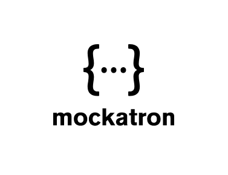

<p align="center">
    
</p>

# Mockatron

Mockatron is a simple tool that helps front-end developers and testers setup a quick Mock HTTP API Server without having to write any backend code.

By defining a simple set of configuration rules, you can stand up a mock HTTP server that can return static as well as dynamic response data.

- Configure API Routes by defining constraints 
- JSON style configuration for requests and responses
- Handlebars style templating to support generation of responses from templates. Support for static responses are also available.
- Enable Proxying to mock only specific routes and redirect others to your actual web server.

# Install

NPM package coming soon! To build locally type the following command from the root directory - 

`$ npm install --global .` 

# Usage

`$ mockatron --config /path/to/.mockatron --out /destination/folder`

Once the mock server is generated, `cd` to the output directory.

`$ npm i`   
`$ npm start`


# The .mockatron configuration folder

Create a folder named `.mockatron` in the current working directory. The folder should contain a `main.json` and other json files for resource definitions.

Consider a simple example: 

```
${cwd}/.mockatron
    --> main.json
    --> products.json
    --> static-products.json
```

## The main.json file

Here is an example of a simple `main.json` file

```
{
    "contextPath": "/api/mock",
    "routes": [
        {
            "path": "/products",
            "method": "GET",
            "responses": [
                {
                    "constraint": "{{{and 
                                          (neq (query 'search') undefined) 
                                          (gt (query 'price') 0)
                                   }}}",
                    "statusCode": 200,
                    "body": "{{{def 'products' 'productSearchNEQ'}}}"
                },
                {
                    "body": "'no results found'",
                    "statusCode": 200
                }
            ]
        },
        {
            "path": "/products/:id",
            "method": "GET",
            "responses": [
                {
                    "statusCode": 200,
                    "body": "{{{def 'products' 'productDetail'}}}"
                }
            ]
        },
        {
            "path": "/static-product",
            "method": "GET",
            "responses": [
                {
                    "statusCode": 200,
                    "body": "{{{file 'static-products'}}}"
                }
            ]
        }
    ]
}
```

The `main.json` file is used to define the routes in the API Server. Each route should contain the following keys - 

`path`: The path relative to the domain and the context path (e.g /products/?price=100). Path can be Node.js Express style routes.  
`method`: The HTTP verb (e.g `GET`).  
`responses`: An array of responses that this route could return based on various `constraints` or rules.  

## The Response Object

Each object in the `responses` array should define the following keys - 

`constraint`: A set of rules that evaluate whether to execute the response or not. These are essentially handlebars style templates that can be used. 
              For example, `{{{gt (query 'price') 0}}}` would evaluate whether the query param named `price > 0`. A complete list of helpers is provided below.  
              
`status`: The HTTP Response Status code.  

`body`: The body of the response to be returned. Currently only JSON format is supported. Responses can be static - from a simple text file to dynamic - random        responses based on a set of templates that can be defined. A complete set of documentation on these are provided below.

## Dynamic Resource definitions

Here is a simple example of a `products.json` file

```
{
    "productSearch": [
          {{#array 5 20}}
            {
              "price": "{{float 50.0 5000.0}}",
              "rating": {{int 1 5}},
              "id": "{{pathValue 'id'}}",
              "name": "{{word 2}}",
              "description": "{{paragraph 3}}",
              "randomId": "{{uuid}}"
            }
          {{/array}}
    ],
}
```

The `productSearch` object was referenced in one of the responses above in the `main.json` file. Mockatron will evaluate this response template each time it encounters the particular route and constraint and generates a random response based on the template. A complete list of helpers is defined below.

## Static Resource Definitions

Static resource can be literally any JSON file that needs to be returned each time the request matches the resource. No computation or random data is generated in this case. The file is returned as-is when the particular constraint matches.

```
{
    "price": 20.0,
    "rating": 3,
    "id": "sdfas-342sdf-34asf-34asdf-34sxz",
    "name": "This name is never gonna change",
    "description": "This description too is not gonna change.",
    "randomId": "not-really-a-random-Id"
} 
```

# Available Constraint Helpers 

To be filled

# Available Response Helpers

To be filled

# TODO
1. Allow filtering output for array definitions e.g filter -> item => item.amount > 10 && item.amount < 20
2. auto generate output (low priority)
3. project -> keys -> 
4. hosting -> take in multiple JSONs and generate server, CRUD 
5. UI -> for generating JSON
6. Github Actions
